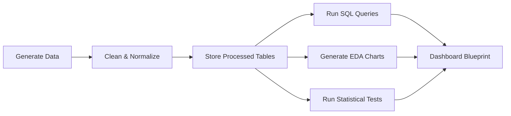

# Social Media Trend Analysis

## Project Overview
This project implements a complete end-to-end social media analytics workflow for a synthetic dataset of 5,500 posts. It covers data generation, cleaning, relational processing, SQL analysis, exploratory data analysis, statistical testing, and executive dashboard planning.

## System Architecture


## Files Created
- data/raw_data.csv: generated source dataset
- data/processed/Fact_Posts.csv: fact table for posts
- data/processed/Dim_Users.csv: user dimension table
- data/processed/Dim_Time.csv: time dimension table
- scripts/generate_data.py: synthetic data generation
- scripts/clean_data.py: cleaning and transformation pipeline
- scripts/eda.py: correlation and time-series visualization
- scripts/statistics.py: ANOVA and t-test analysis
- database/queries.sql: SQL analysis queries
- dashboard/*.md: wireframe, BI implementation, and executive brief

## Quick Start
```bash
python scripts/generate_data.py
python scripts/clean_data.py
python scripts/eda.py
python scripts/statistics.py
```

## Run the Streamlit Website
```bash
streamlit run streamlit_app.py
```

## Notes
- The website uses Streamlit and Altair for a polished professional dashboard experience.
- Install dependencies with `pip install pandas numpy scipy matplotlib seaborn streamlit altair`.
- All outputs are written under the data/ and dashboard/ directories.
